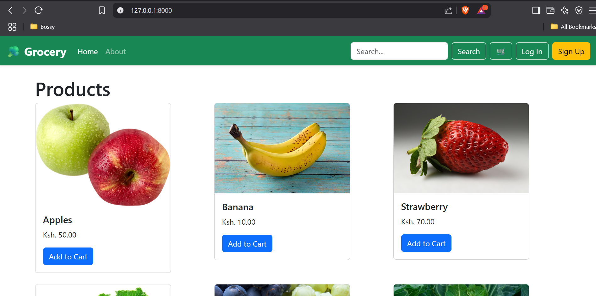

# 🥦 Grocery App

Welcome to **Grocery App**, your one-stop shop for fresh, affordable, and quality groceries delivered straight to your doorstep.



---

## 🚀 Features

- 🥕 Browse a variety of grocery items
- 🛒 Add products to cart
- 🔍 Search for items by name
- 👤 User authentication (sign up, login, logout)
- 📦 View and manage your cart
- ✅ Secure checkout process (coming soon!)

---

## 📸 Screenshots

- **Home Page:** Displays a list of grocery products
- **Search Function:** Easily find your desired items
- **Cart Page:** View items added to your cart
- **Responsive Design:** Mobile and desktop-friendly

---

## 🛠️ Tech Stack

- **Backend:** Django (Class-Based Views)
- **Frontend:** Bootstrap 5, HTML, CSS
- **Database:** SQLite (default for development)
- **Auth:** Django built-in authentication

---

## 📂 Project Structure

```bash
Grocery-app/
├── products/              # Django app for product logic
│   ├── models.py          # Product, Order, OrderItem, Customer models
│   ├── views.py           # Class-based views for listing, searching, cart
│   └── templates/
├── static/                # CSS, JS, images
├── templates/             # Base and page templates
├── assets/                # Screenshots and README assets
├── manage.py
└── README.md
